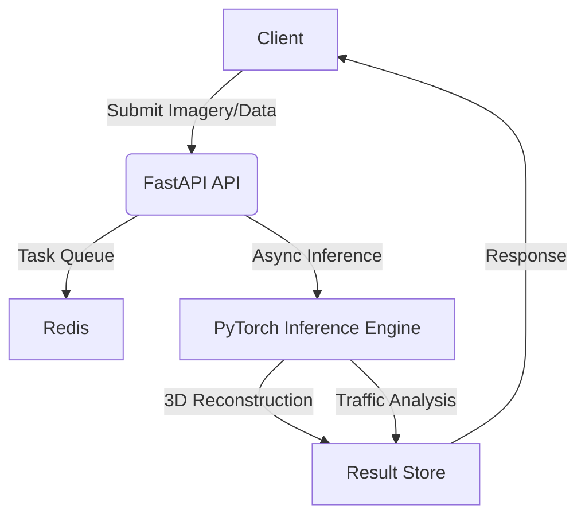

# Urban Intelligence AI Engine

Urban Intelligence AI Engine is a high-performance, scalable AI platform designed for modern urban environments. It provides real-time traffic analysis, 3D scene reconstruction from imagery, and advanced urban data processing.

## Architecture



## Features

- **Real-time Traffic Analysis**: Leverages computer vision to analyze traffic flow, detect congestion, and predict urban mobility patterns.
- **3D Scene Reconstruction**: Utilizes state-of-the-art transformer-based models and PyTorch to reconstruct 3D environments from 2D imagery.
- **Asynchronous Processing**: Scalable architecture using FastAPI and background tasks for high-throughput data processing.
- **Production-Ready**: Containerized with Docker and orchestrated via Docker Compose, including health checks and structured logging.

## Setup Guide

### Prerequisites

- Python 3.9+
- Docker & Docker Compose
- NVIDIA GPU (Optional, for CUDA-accelerated inference)

### Local Installation

1. Clone the repository:
   ```bash
   git clone https://github.com/gauravgosaindev/urban-intelligence-ai-engine.git
   cd urban-intelligence-ai-engine
   ```

2. Install dependencies:
   ```bash
   pip install -r requirements.txt
   ```

3. Run the application:
   ```bash
   uvicorn app.main:app --reload
   ```

### Docker Deployment

```bash
docker-compose up --build
```

The API will be available at `http://localhost:8000`. Documentation can be found at `http://localhost:8000/docs`.

## CI/CD

Automated testing and linting are handled via GitHub Actions.

## License

MIT